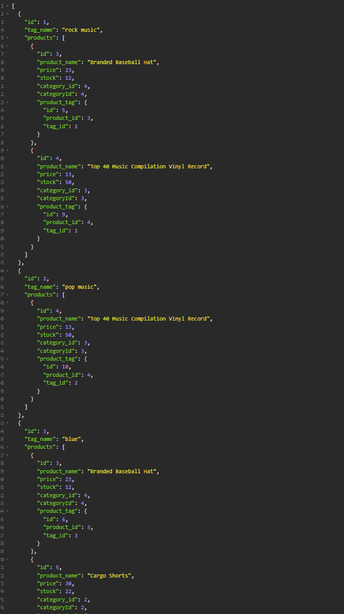

# E-Commerce Back End
  
  

  ## Description

In the E-Commerce Back End you will be able to create a functioning and interactive database for your company. You can use tags to view similar items to one another, categories to view products within the same category or simply the products themselves. You are able to add, update and remove products at will.

  ## Table of Contents
  * [Install](#install)
  * [Usage](#usage)
  * [License](#license)
  * [Contributing](#contributing)
  * [Testing](#testing)
  * [Questions](#questions)

## Install

To install all necessary dependencies, use the following command:

~~~
npm i
~~~

## Usage

To use the appplication, use the following command: 

~~~
First, the user will need to rename the .envEXAMPLE file and include appropriate login info.
The user will need to login to mysql on their machine and run source db/schema. 
Then they will need to seed the database via npm run seed.
~~~

## License

This project is under the MIT license!

## Contributing
To contribute please contact me at the email below.

## Testing

To test the application, use the following command:

~~~
none
~~~

## Questions

For any questions regarding the repo or application, please contact me at jacobllewis@outlook.com. I do have additional projects on display at https://github.com/JLewis1995/.

https://github.com/JLewis1995/Swifty_E-Commerce_Back_End

https://youtu.be/0X8_KLD3uI8

